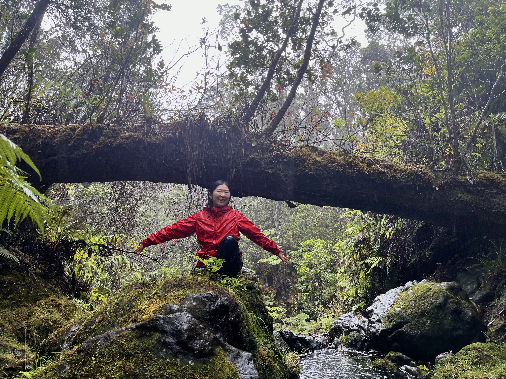

# Mei Iwamoto
## Repository Content
* Week 2
  * Weight data
  * Week 2 Script
 

## About me

Hi my name is Mei! I'm from the island of Kaua'i but also grew up here on O'ahu. I'm currently a Master's student in the Zoology Program and in the Medeiros Lab, where I research ways to support landscape-scale mosquito suppression here in Hawai'i in the context of avian disease and Hawaiian honeycreeper conservation.   
When I'm not fighting my mosquitoes in the lab, I like to go thrifting, play video games, and spend time with friends and family (and our cat Carrot!)
